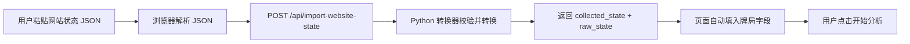

# Real Website State JSON Import V0.3A Design

Date: 2026-07-01

## Goal

Build a manual import path for real poker test-site state.

In plain words: the user can copy a hand-state JSON object from the test website, paste it into the local Poker LBS-Lite panel, convert it into the existing LBS raw state, fill the panel fields, and then click `开始分析`.

This is the bridge between V0.2 simulated collection and later automatic website reading.

## Why This Step Comes Next

V0.2 proved that a website-style state can be converted and analyzed.

V0.3A proves that a real website-style state can be pasted into the tool and accepted by the same converter. This avoids building automatic DOM/OCR collection before the data contract is proven.

## User Workflow

1. User opens the local panel at `http://127.0.0.1:8765/`.
2. User copies a JSON state object from the poker test website or a manual test source.
3. User pastes it into a new `网站状态 JSON` text area.
4. User clicks `导入网站状态`.
5. The local tool validates and converts the JSON.
6. The existing card, board, pot, stack, situation, and bet-size fields are filled from the converted raw state.
7. The debug panel shows both the imported website state and the converted raw state.
8. User clicks `开始分析` to get a strategy result.

Collection and analysis remain separate on purpose.

## Input JSON Contract

V0.3A uses the same website-state shape as V0.2:

```json
{
  "table_id": "real-table-1",
  "hand_id": "real-hand-001",
  "street": "flop",
  "position": "BTN_vs_BB",
  "current_actor": "hero",
  "hero_cards": ["Ah", "Kh"],
  "board_cards": ["Kc", "8d", "3s"],
  "pot": 100,
  "stacks": {
    "hero": 900,
    "villain": 900
  },
  "facing_action": {
    "player": "BB",
    "action": "check",
    "size": 0
  }
}
```

Facing a bet uses:

```json
{
  "facing_action": {
    "player": "BB",
    "action": "bet",
    "size": 50
  }
}
```

## Backend Design

Reuse the existing converter:

- `app.collector.website_state.convert_website_state_to_raw_state`

Add a web API helper:

- `app/web_api.py`
  - `import_website_state_payload(payload)`
  - Accepts a parsed JSON object.
  - Rejects non-object payloads with `INVALID_PAYLOAD`.
  - Converts valid website state into raw LBS state.
  - Returns:

```json
{
  "ok": true,
  "collected_state": {},
  "raw_state": {}
}
```

For converter errors, return:

```json
{
  "ok": false,
  "error": "INVALID_COLLECTED_STATE: hero_cards"
}
```

Add a local server endpoint:

- `POST /api/import-website-state`

The endpoint accepts JSON from the local panel only. The real poker test website still does not call the API.

## Frontend Design

Extend the existing Chinese local panel with a compact import area near the V0.2 collection controls.

Add:

- Label: `网站状态 JSON`
- Text area: `id="websiteStateJson"`
- Button: `导入网站状态`
- Optional example hint inside the text area showing the expected JSON shape.

On click:

1. Read text area content.
2. Parse JSON in the browser.
3. If JSON parsing fails, show `JSON 格式错误`.
4. Send parsed object to `POST /api/import-website-state`.
5. If the response is not ok, show the returned error.
6. If ok, reuse the existing `applyRawState(rawState)` function from V0.2.
7. Update debug JSON with:

```json
{
  "imported_state": {},
  "raw_state": {}
}
```

8. Show `网站状态已导入，可以开始分析。`

## Data Flow



## Error Handling

Use simple visible errors:

- Empty text area: `请先粘贴网站状态 JSON`.
- Invalid JSON syntax: `JSON 格式错误`.
- Non-object JSON payload: `INVALID_PAYLOAD`.
- Missing website field: `INVALID_COLLECTED_STATE: <field>`.
- Unsupported street, position, actor, player, or action: `UNSUPPORTED_COLLECTED_STATE: <field>`.
- Invalid bet size: `INVALID_COLLECTED_STATE: facing_action.size`.
- Unexpected backend failure: `INTERNAL_ERROR`.

The debug panel should show the failed response when the backend returns a structured error.

## Testing

Add focused tests:

- API helper imports a valid website state and returns `ok: true`, `collected_state`, and `raw_state`.
- API helper rejects a non-object payload with `INVALID_PAYLOAD`.
- API helper returns converter errors for malformed website state.
- Server endpoint `POST /api/import-website-state` returns 200 for valid state.
- Server endpoint returns 400 for invalid JSON and invalid website state.
- Static UI test confirms:
  - `网站状态 JSON`
  - `导入网站状态`
  - `id="websiteStateJson"`
  - `function importWebsiteState()`
  - `fetch("/api/import-website-state"`
  - `网站状态已导入，可以开始分析。`

Run the full test suite after implementation.

## Non-Goals

V0.3A does not implement:

- Automatic DOM reading from the real website.
- OCR screen reading.
- Browser extension or browser plugin control.
- Letting the poker test website call the API.
- Batch hand import.
- Hand history storage.
- Model training.
- Multi-person/team strategy expansion.
- Strategy-engine changes.
- A full Solver.

## Future Path

After V0.3A works:

1. V0.3B can define exactly how the real test website exposes the same JSON object, such as `window.__POKER_STATE__`.
2. V0.4 can add automatic DOM reading if a clean state object is not available.
3. V0.5 can consider OCR only if object/DOM collection is impossible.

## Success Criteria

V0.3A is successful when:

- User can paste a valid website-state JSON object into the local panel.
- The tool converts it into raw LBS state.
- The existing panel fields are filled correctly.
- User can click `开始分析` and receive a strategy result.
- Bad JSON and malformed website state produce readable errors.
- Existing V0.2 `读取采集状态` examples still work.
- Existing manual presets still work.
- All tests pass.

## Self-Review

- Scope is limited to manual JSON import.
- It reuses the V0.2 converter instead of duplicating conversion in JavaScript.
- The real website still does not call the API.
- Automatic website reading is clearly saved for a later version.
- The strategy engine contract stays stable.
- The spec has no unfinished requirement markers.
