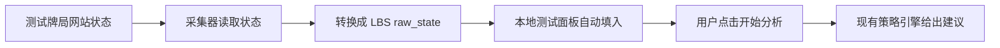

# Website State Collector V0.2 Design

Date: 2026-07-01

## Goal

Build the first website data-collection bridge for Poker LBS-Lite.

The user's poker test website will not call the strategy API. Instead, Poker LBS-Lite will read a collected table state, convert it into the existing LBS raw state format, and then use the current local analysis flow.

In plain words: the website only shows the hand. Our local tool reads the hand state, fills the local panel, and then runs strategy analysis.

## V0.2 Scope

V0.2 proves the collection path with a local simulated website state. It does not connect to the real website yet.

The local browser panel will add:

- A scenario selector for collected examples, starting with check and bet.
- A button named `读取采集状态`.
- Auto-fill behavior that copies the converted state into the existing input fields.
- Debug JSON that shows both the collected website state and the converted LBS raw state.

The user still clicks `开始分析` after reading the collected state. This keeps collection and analysis separate and easy to inspect.

## Source State Shape

The simulated website state should look like a small object that a real table page could expose later:

```json
{
  "table_id": "demo-table",
  "hand_id": "demo-check-001",
  "street": "flop",
  "position": "BTN_vs_BB",
  "current_actor": "hero",
  "hero_cards": ["Ah", "Kh"],
  "board_cards": ["Kc", "8d", "3s"],
  "pot": 100,
  "stacks": {
    "hero": 900,
    "villain": 900
  },
  "facing_action": {
    "player": "BB",
    "action": "check",
    "size": 0
  }
}
```

Facing a bet uses the same shape:

```json
{
  "facing_action": {
    "player": "BB",
    "action": "bet",
    "size": 50
  }
}
```

## Conversion Contract

The collector converter turns website state into the existing raw state contract:

- `hero_cards` becomes `known_hands.hero`.
- `board_cards` becomes `board`.
- `stacks.hero` and `stacks.villain` become `effective_stacks`.
- `facing_action.action = check` becomes `action_history: [{"player": "BB", "action": "check"}]`.
- `facing_action.action = bet` becomes `action_history: [{"player": "BB", "action": "bet", "size": <amount>}]`.
- The converter fills stable V0.1 engine fields:
  - `mode: "single"`
  - `table_size: 2`
  - `street: "flop"`
  - `position: "BTN_vs_BB"`
  - `current_actor: "hero"`
  - `hero_seat: "hero"`
  - `unknown_seats: ["villain"]`
  - `objective: "actor_ev"`

## Component Design

Add a small collector module:

- `app/collector/website_state.py`
  - Validates the website-style state.
  - Converts it into raw LBS state.
  - Returns clear errors for missing or unsupported fields.

Add local sample states:

- `app/collector/sample_website_states.py`
  - Provides `check` and `bet` demo states.
  - Acts like a fake website state source for V0.2.

Extend the local web API layer:

- `app/web_api.py`
  - Adds a helper that loads a sample collected state and converts it.
  - Returns both `collected_state` and `raw_state` for inspection.

Extend the local web server:

- `GET /api/collected-state?scenario=check`
- `GET /api/collected-state?scenario=bet`

The endpoint returns:

```json
{
  "ok": true,
  "collected_state": {},
  "raw_state": {}
}
```

Extend the Chinese local panel:

- Add a small collection area near the existing presets.
- Add `读取采集状态`.
- When clicked, call `/api/collected-state`.
- Fill the existing card, board, pot, stack, situation, and bet-size fields from `raw_state`.
- Show the returned data in the debug panel.

## Data Flow



## Error Handling

Use simple, visible errors:

- Unknown scenario: `UNSUPPORTED_COLLECTED_SCENARIO`.
- Missing required website field: `INVALID_COLLECTED_STATE: <field>`.
- Unsupported street, position, or action: `UNSUPPORTED_COLLECTED_STATE: <field>`.
- Invalid bet size: `INVALID_COLLECTED_STATE: facing_action.size`.

The web server should return HTTP 400 for user-correctable collection errors and keep HTTP 500 only for unexpected internal failures.

## Testing

Add focused tests:

- Converter turns the check sample into the expected raw LBS state.
- Converter turns the bet sample into the expected raw LBS state.
- Missing fields return a readable error.
- Unknown scenario returns `UNSUPPORTED_COLLECTED_SCENARIO`.
- The server endpoint returns `ok: true`, `collected_state`, and `raw_state`.
- The Chinese panel contains `读取采集状态` and calls `/api/collected-state`.

Run the full test suite after implementation.

## Non-Goals

V0.2 does not implement:

- Real website DOM reading.
- OCR screen reading.
- Browser extension or browser plugin control.
- External website scraping.
- Batch hand testing.
- Strategy-engine changes.
- Multi-person/team strategy execution.
- Model training.
- A full poker Solver.
- Letting the website call the local API.

## Future Path

V0.2 is the bridge test.

After V0.2 works:

1. V0.3 can read a real state object exposed by the test website, such as `window.__POKER_STATE__`.
2. V0.4 can add DOM fallback if the website cannot expose a clean state object.
3. V0.5 can consider OCR only if object/DOM collection is impossible.
4. Multi-person/team strategy can be added later by expanding the collected state from one known hand to multiple known hands.

## Success Criteria

V0.2 is successful when:

- The local panel can load a collected check scenario.
- The local panel can load a collected bet scenario.
- The loaded state appears in the debug JSON.
- The user can click `开始分析` and get the same strategy result as manual input.
- Existing manual presets still work.
- All tests pass.

## Self-Review

- Scope is limited to a local simulated collection bridge.
- The website still does not call the API.
- The real website integration is clearly saved for a later version.
- The existing engine contract stays stable.
- The spec has no unfinished requirement markers.
